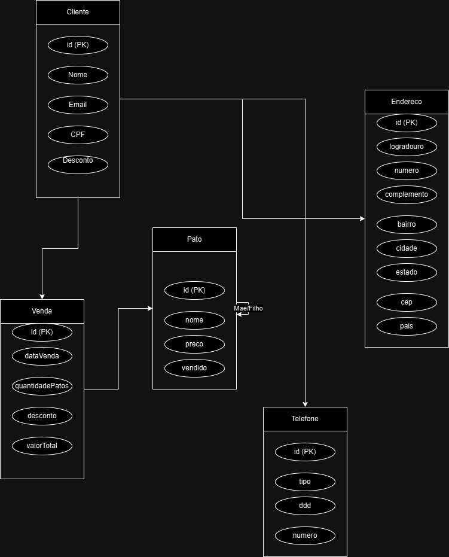

# Granja de Patos

Este projeto é um serviço Spring Boot para o desafio "Granja de Patos" proposto pela empresa Preço Justo.

## Índice

- [Introdução](#granja-de-patos)
- [Tecnologias Utilizadas](#tecnologias-utilizadas)
- [MER - Modelo Entidade Relacionamento](#mer---modelo-entidade-relacionamento)
- [Cronograma](#cronograma)
- [Pré-requisitos](#pré-requisitos)
- [Executando o Projeto](#executando-o-projeto)
  - [Sem Docker](#sem-docker)
  - [Com Docker](#com-docker)

## Tecnologias Utilizadas

- Spring Boot
- Java 17
- Swagger para documentação da API
- GitHub Actions para CI/CD

## MER - Modelo Entidade Relacionamento

<p align="center">
  
</p>

## Cronograma

| Atividade                              | Tempo   | Descrição                                                                                                                                                                                        |
| -------------------------------------- | ------- | ------------------------------------------------------------------------------------------------------------------------------------------------------------------------------------------------ |
| Configuração inicial                   | 1 hora  | Configuração do ambiente de desenvolvimento, incluindo dependências, Swagger, tratamento global de exceções, e integração contínua com GitHub Actions.                                           |
| Adição das entidades e relacionamentos | 1 hora  | Análise e implementação das entidades do domínio e seus relacionamentos, com foco na integridade e validação dos dados.                                                                          |
| Adição dos controladores e services    | 5 horas | Desenvolvimento dos componentes de lógica de negócios (serviços) e interfaces de comunicação (controladores) para as entidades Cliente, Pato e Venda, incluindo tratamento adequado de exceções. |
| Gerar relatório em Planilha            | 4 horas | Implementação da lógica para geração de relatórios em formato de planilha, seguindo critérios específicos de hierarquia do relacionamento dos Patos.                                             |
| Gerar relatório em PDF                 | 4 horas | Configuração do layout e desenvolvimento da funcionalidade para exportação de relatórios no formato PDF, utilizando o template.                                                                  |
| Refatoração e testes                   | 4 horas | Revisão e melhoria do código para garantir legibilidade e conformidade com boas práticas, além da execução de testes para validar as funcionalidades implementadas.                              |

Para acessar o relatório completo em formato Excel, [clique aqui](docs/cronograma.xlsx).

## Pré-requisitos

- Java 17 ou superior
- Maven 3.6.3 ou superior
- Docker (opcional, para rodar com Docker)

## Executando o Projeto

### Sem Docker

1. Clone o repositório:

   ```sh
   git clone https://github.com/brenogonzaga/desafio-preco-justo.git
   cd desafio-preco-justo
   ```

2. Compile o projeto e baixe as dependências:

   ```sh
   mvn clean install
   ```

3. Configura as variáveis de ambiente:

   Crie um arquivo chamado `application.properties` na pasta `src/main/resources` com as seguintes configurações:

   ```sh
    spring.datasource.url=jdbc:postgresql://localhost:5432/seu_banco_de_dados
    spring.datasource.username=seu_usuario
    spring.datasource.password=sua_senha
    spring.datasource.driverClassName=org.postgresql.Driver
   ```

4. Execute o projeto:

   ```sh
   mvn spring-boot:run
   ```

5. O serviço estará disponível em `http://localhost:8080`.

### Com Docker

1. Clone o repositório:

   ```sh
   git clone https://github.com/brenogonzaga/desafio-preco-justo.git
   cd desafio-preco-justo
   ```

2. Construa a imagem Docker:

   ```sh
   docker build -t relatorio-patos .
   ```

3. Execute o container Docker:

   ```sh
   docker run -p 8080:8080 relatorio-patos
   ```

4. Compile o projeto e baixe as dependências:

   ```sh
   mvn clean install
   ```

5. Execute o projeto:

   ```sh
   mvn spring-boot:run
   ```

6. O serviço estará disponível em `http://localhost:8080`.
